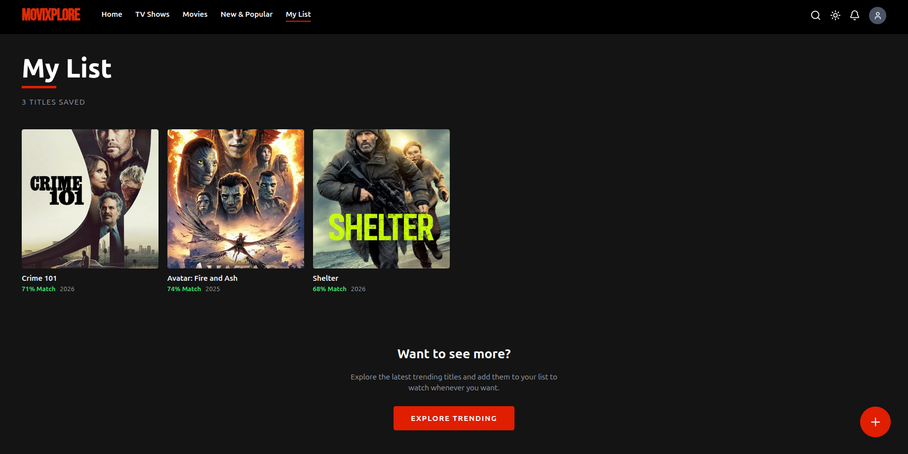
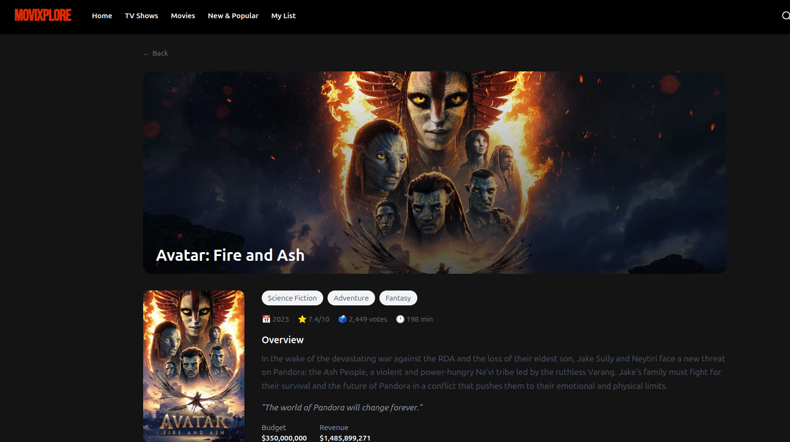

# :cinema: MoviXplore

## :beginner: Project Overview

**MoviXplore** is a web movie explorer application that allows users to search, filter, view detail info about a movie and save their favorite movies in a watch list. Built with **React**, **TailwindCSS**, **Framer Motion**, **Lucide-react** and **TanStack Query**.

## :file_folder: Project Structure
  ```
   src/
   ├── components/   # Reusable UI components
   ├── pages/        # Page components
   ├── hooks/        # Custom React hooks
   └── api/          # TMDB API integration
   ```

## :sparkles: Features

- Recently Viewed  
- New Releases 
- Save favorite movies
- Dark/Light mode toggle
- Responsive design for mobile and desktop
- Trending movies

## Preview
- Favorite Page


- Movie Details Page



### Environment Variables
  Create a `.env.local` file in the root directory: VITE_TMDB_API_KEY=your_api_key_here
   


## :electric_plug: How to Run the Project

### Prerequisites
- Node.js (>=16)
- npm or yarn

### Steps

1. Clone the repository:

- git clone [project repo](https://github.com/AsohLove/MoviXplore.git)
- cd movixplore

2. Install project dependencies
- npm install
OR
- yarn install

3. Start development server
- npm run dev
OR
- yarn dev

4. Open your browser at [localhost](http://localhost:5173)

:star: **Tech Stack**
- React – UI library
- TailwindCSS – Styling
- Framer Motion – Animations
- Lucide React - Icons
- TanStack Query – Data fetching and caching
- React Router DOM – Routing
- TMDB API – Movie data

:technologist: **Created By:**

- GitHub: [@loveasoh](https://github.com/AsohLove)
- Twitter: [@loveasoh](https://x.com/LoveTheModifier)
- LinkedIn: [@love asoh](https://www.linkedin.com/in/asohlove/)

## :lock: License
This project is [MIT](./LICENSE) licensed.
